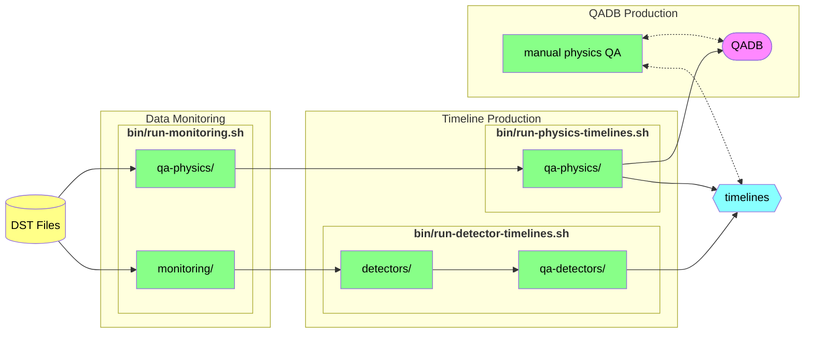

# clas12-timeline

Timeline production for CLAS12. Timelines are deployed to [clas12mon](https://clas12mon.jlab.org).

To download,
```bash
git clone https://github.com/JeffersonLab/clas12-timeline.git
```

To build,
```bash
./bin/build-all.sh        # standard build
./bin/build-all.sh clean  # alternatively, a clean build
```

## Detector Timelines
The detector timeline production procedure is outlined in the following steps:

### 1. `clas12_monitoring`
To submit `clas12_monitoring` for each run from specified directory one should run these commands, e.g.:
```bash
./bin/run-monitoring.sh   # print usage guide
```

To run it interactively, see the [monitoring subdirectory](monitoring)

### 2. Detector Timelines
To run, execute following command,
```bash
./bin/run-detectors.sh "run group" "cooking version" "/path/to/monitoring/files/""
```
with the adequate arguments, e.g.,
```bash
./bin/run-detectors.sh rgb pass0v25.18 /volatile/clas12/rg-b/offline_monitoring/pass0/v25.18/
```

### 3. Detector QA
To run,
```bash
./bin/run-qa.sh TIMELINE
```
where `TIMELINE` is either the URL, for example,
```
https://clas12mon.jlab.org/rga/pass1/version3/tlsummary
```
or the relative path to the timeline, which for this example would be `rga/pass1/version3`. The output
URL containing QA timelines will be printed at the end of the script output; for this example, it will be
```
https://clas12mon.jlab.org/rga/pass1/version3_qa/tlsummary
```

See [further details](qa-detectors/README.md) for more information.

# Physics QA Timelines
The physics QA is typically performed only on a fully cooked dataset, whereas the above detector timeline production
is produced on much smaller data subsets. The physics QA timeline production is thus separate from the
detector timeline production, and produces the QADB.

See [its documentation here](qa-physics) for more details.


# Flowchart
Here is a flowchart illustrating the data and steps for timeline production:


